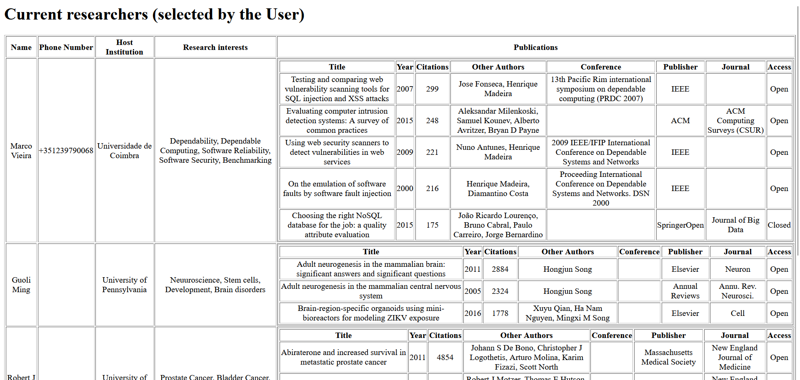
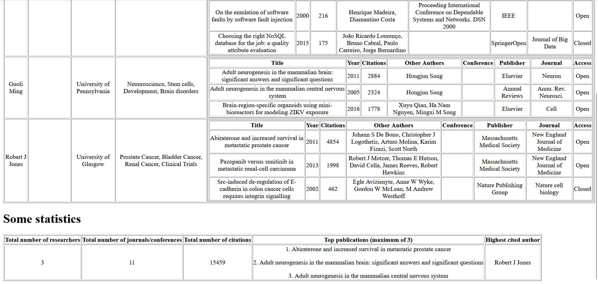

# ResearchXMLProcessor

A Java-based application for processing, analyzing, and transforming XML data on research publications and researchers. 
It demonstrates XML validation, processing, and transformation with JAXB, XML Schema (XSD), and XSLT, allowing users to filter data by preferences, generate statistics, and view processed data in HTML format. 
Project developed for Systems Integration class.

## Components

1. **Selector** - Reads an XML document holding information about researchers (e.g., name, affiliation, ...) and publications (e.g., paper title, conference name, …), then validates it and processes the corresponding data, to write a shorter XML document (based on user preferences).
2. **Processor** - Analyzes data (XML document produced by the Selector) and generates statistics.
3. **HTMLViewer** - Transforms the XML output into an HTML view, using XSLT.

## Examples

